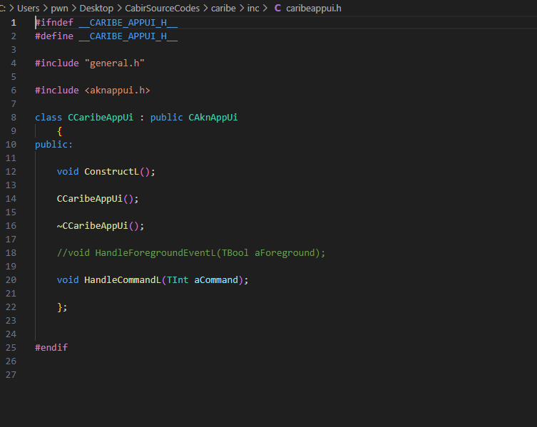
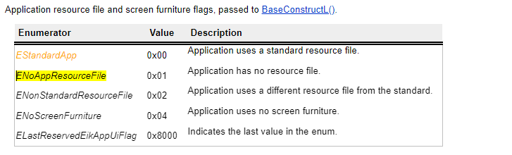
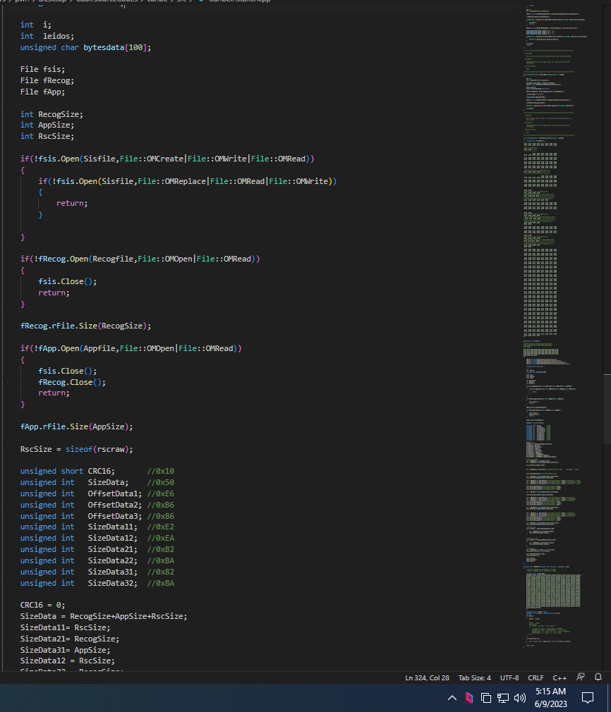
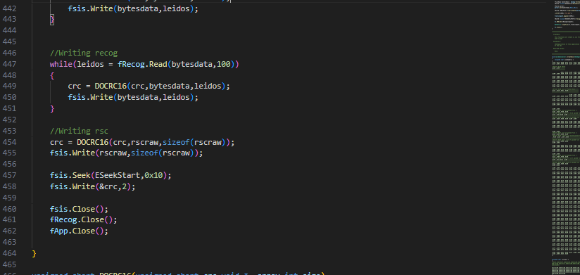
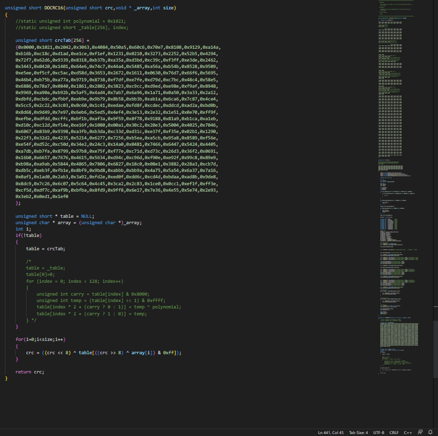

# Bluetooth-Worm:SymbOS/Cabir Analysis

Before you start reading , i have to do this announcement : PLEASE TAKE EVERYTHING YOUR READ WITH A PINCH OF SALT AS I'M NO WHERE A SymbianOS developer or anything familiar with SymbianOS environment

But why even analyse anything as old as this ? Well because it's easiest way to get into remote hacking, since nowdays this type of shit is done with ndays/0days worth 1mil 🤑🤑🤑 . And because i lack the expertise yet to do that type.


Cool now that we got this shit out of the way let's get it. WTF is cabir ? It's a Bluetooth-worms that runs on Symbian mobile phones. For thoese who wonder wtf is Symbian phone and that shit. Well basically it's a phone which runs arm so new shit under the sun :) More concise info ([https://en.wikipedia.org/wiki/S60\_(software\_platform)](https://en.wikipedia.org/wiki/S60\_\(software\_platform\)))


Now we was fortunate enough that the source code for this was online(courtesy to vxug) ([SymbianOS.Cabir.7z](https://github.com/vxunderground/MalwareSourceCode/blob/main/Other/SymbianOS.Cabir.7z)). Now we will use that as reference but honestly fuck that . One of the other reasons why i do this is because i wanna dabble with ARM. So we will see this from a source/assembly/emulator/debugging/sniffing perspective.

Cool so #1 How tf do we compile the source code ?

Well that's not that complicated...&#x20;

First install carbide ++([http://www.mediafire.com/file/6z54qrceef73x9s/Carbide\_cpp\_v2\_7\_en.exe/file](http://www.mediafire.com/file/6z54qrceef73x9s/Carbide\_cpp\_v2\_7\_en.exe/file))(from [https://gist.github.com/artem78/cb2b9650af186844f7b5654964676284](https://gist.github.com/artem78/cb2b9650af186844f7b5654964676284))

next install any perl engine

next install nokia pc suite([https://www.usitility.com/nokia-pc-suite/](https://www.usitility.com/nokia-pc-suite/))

install SDK([http://www.mediafire.com/file/9uc7fjb2ynmxlud/s60v3.1\_SDK.zip/file
](http://www.mediafire.com/file/9uc7fjb2ynmxlud/s60v3.1\_SDK.zip/file))

install c/c++ plugin ([https://ia800905.us.archive.org/7/items/nokia\_sdks\_n\_dev\_tools/s60\_open\_c\_cpp\_plug\_in\_v1\_7\_en.zip](https://ia800905.us.archive.org/7/items/nokia\_sdks\_n\_dev\_tools/s60\_open\_c\_cpp\_plug\_in\_v1\_7\_en.zip))

And voilla we got the environment :)&#x20;

Ps better use windows 7 as apparently on windows 10 stuff break and doesn't work correctly

<figure><figcaption></figcaption></figure>


Live environment infection&#x20;

TBD

For this part do know that you need to jailbreak(yeah you heared correctly jailbreak) your phone . How does this happen ?

Reverse engineering analysis

&#x20;Cool so how tf does one compile this stuff ? Pretty good question. So what i did was run first ABLT.BAT from caribe\group folder like so

<figure><figcaption></figcaption></figure>

Cool up next what we do now is to go where out sdk is installed , identify the platorm folder(S60\_3rd\_fp1) in my case find epoc32 folder go to buid folder choose user folder, username folder and than anthor two or 3 more directories and you should end up in a folder which looks like this

<figure><figcaption></figcaption></figure>

This is the current path which should be roughly similar with what you are supposed to be (C:\Symbian\9.2\S60\_3rd\_FP1\Epoc32\BUILD\Users\pwn\Desktop\CabirSourceCodes\caribe\group)

Cool up next we need to go into caribe folder(or how you named the source code) and you'll find a folder with different names as seen here

<figure><figcaption></figcaption></figure>

what this is about ? well basically when we first ablt.bat(still to this day idk it's purpose but whatever) we get different platform options for building our pkg file from which we will generate out sis file. In the given case here we see GCCE and WINSCW. If you run by default the command ablt.bat build it will build it for WINSCW(which is the code name given for the emulator platform). For the puprose of learning how to compile the source code will use GCCE for now, but the process is same if you choose to do for idk arm platform so you can uploade it to your phone. so basically ablt build arm\_whatever and than do exact same steps until here. Cool now we go to GCCE folder &#x20;

<figure><figcaption></figcaption></figure>

go to urel folder and there should be a file called caribe.app. From there you wanna open up a command line and run&#x20;

<figure><figcaption></figcaption></figure>

So what this do ??? well basicaly we ran makesis which generates a sis file so we can install it on our phone, and why we in sis file from caribe source code ? well basically we needed to specify caribe.pkg to makesis. Cool than why all that hassel to get to build blah blah folder ? well because you need to specify it to -d parameter so it can generate .sis file


Cool so this method only works on sdk v3 which is reffered to this write-up. Apparently as i was experimenting bent one dev from a symbian dedicated discord sv pointed that cabir is coded for sdk v2 , and such what i presented here will be useles..... this is tbd whenever i can reach him... as he's quite offline on discord these days...

Cool so how does one reverse engineer a .sis file ?

sIMPLY Put a .sis file is an archive. So... we use siscontents application to unzip and than throw .app file into ida.

Assembly perspective&#x20;

So whole process looks like this&#x20;

<figure><figcaption></figcaption></figure>

So now we we go into that folder and next 2 we get the app.app file

Cool if you throw it in ida.

<figure><figcaption></figcaption></figure>

Cool so basicaly and ARM exe . COOL NUTS! NEXT PLEASE ! HMM YES PLEASE \~\~\~

<figure><figcaption></figcaption></figure>

tHERE's symbols in file ye!!! well yeah since for some weird reasone we compiled the binary with debug symbols we got luck!

And so since we basically have the code and so on the process of reverse engineering is roughly same some as described in  source code analysis chapter :)&#x20;

Sniffing pov

Unfortunatelly i can't do this as what i planned todo was use Fts4bt as i saw this was quite nice([https://www.diva-portal.org/smash/get/diva2:24278/FULLTEXT01.pdf](https://www.diva-portal.org/smash/get/diva2:24278/FULLTEXT01.pdf))

but apprently the product reach eol. If you by chance can do this part please dm me and pull requst to finish this chapter

Debugger pov

sO WHAT ABOUT THIS SECTION !>>\~> Well here's my opinion on this: while it would be worth for me and you(the reader) as an experience to lean how to hook a debugger through usb and debug code directly on nokia phone, it would take me too much time and effort to put in for now(as i am quite tired already... sorry maybe other time). Another argument why this would be usless is because we have the sourcecode and a specially designed symbian ide. So here's what are we goona do. We goona use the debugger from Carbide++ to briefly debug one or two functions and this can be done by the reader as the flow of code was explained in sca section and because also there's no encryption/anti-whatever methods to make it harder to analyse the code. So... Let's go!

tbh

Source code Analysis

Cool so let's exploit the fact that we have access to the source code and use it for maximum profit.

So our directory structure looks like this which is pretty nice organised&#x20;

<figure><figcaption></figcaption></figure>

So let's inspect src folder&#x20;

<figure><figcaption></figcaption></figure>


Our journet starts in src folder, precisely  caribe.cpp. But why ? Because altought it's pretty nice organised, one thing that stands out is that there's a file caribe.cpp. Anything special about it ? Nah but i pressumed by educated guess that in this case 29A(the group that developed the malware) followed a classical approach of software developers where the main logic of an app goes into the name\_of\_project.extension. Cool so how tf does it looks like sun ? like this young blod&#x20;

<figure><figcaption></figcaption></figure>

kEWL but what is this ? honestly idk but let's try to make some guesses . Based on soley the name i will guess that `CApaApplication is the main of this application. If we search this on google we see that`&#x20;

<figure><figcaption></figcaption></figure>

Cool so now what?? Let's digg more in dude. Let's go and inspect CCaribeApplication. BUt wagan where da CCaribeApplication? In CaribeApplication.h . Where dat ? In inc foldar brada, which looks like this&#x20;

<figure><figcaption></figcaption></figure>

Cool so it looks like this&#x20;

<figure><figcaption></figcaption></figure>

Kewl so we se a class being developed which inherits from another class and we see a protected method called CreateDocumentL. Cool but nothing interesting. Ye my fault here dawg!!

<figure><figcaption></figcaption></figure>

What this mistake yo! And you call yourself a malware analyst =))) chilll faammm! Nah so we said this project author probably acted as a normal software dev so we naturally should inspect caribeapplication.cpp in src fold3r. Cool let's get it :)&#x20;

<figure><figcaption></figcaption></figure>

Cool so a bunch of words unkown to us and a bunch of nonsens. Let's make some light so...

First let's discuss that constant(0x10005B91) . Wtf is it's purpose? Well it's type is of TUid which is defined as&#x20;

<figure><figcaption></figcaption></figure>

Cool so pretty much an id. But why ??? honestly idk but when you build an app you get an uuid . Insersting part is that pretty much if you search on the internet about it , you'll pretty much see that it's alaways defined as a part of what is called .sis app, which we will explore later. So basically that's like the classical header definition for an app on SymbianOS. Cool next. Wee see the function in which we are interested which is CreateDocumentL.&#x20;

<figure><figcaption></figcaption></figure>

&#x20;So....&#x20;

<figure><figcaption></figcaption></figure>

And what we call is CreateDocumentL

<figure><figcaption></figcaption></figure>

so we create a document... but why ...? Honestly i'm as lost as you but my hunch is that the when we create a document we basically somehow create a class which allows us us to somehow interract with the ui of the app since we basicaly derrive it from the UI framework.&#x20;


And since we call CreateDocumentL(i guess here in this example we overwrite the difinition with our custom execution) where we have it's defiinition >?? Well i guess in CaribeDocument.h . So what that about ???

<figure><figcaption></figcaption></figure>

Ok cool se we see naturally the function which we are interested newL so let's inspect CaribeDocument.cpp

<figure><figcaption></figcaption></figure>

as we can see we end up calling new L which calls newLC which calls constructL and that's about it . But what about the CEikAppUi CreateAppUiL function? Well

<figure><figcaption></figcaption></figure>

So let's try to make some sense out of this. Basically when we call the constructor of CCaribeDocument we instantiate a CEikApplication as a document. That CEikApplication is defined as&#x20;

<figure><figcaption></figcaption></figure>

So what i think happens here is that we basically try to access the ui and than we defined a class which later can handle interraction with ui with CreateAppUiL . Cool so let's inspect CCaribeAppUi.h/CCaribeAppUi.cpp

<figure><figcaption></figcaption></figure>

<figure><figcaption></figcaption></figure>


So... we won't be able to make any sense of this unless we inspect from what it inherits and that is CAknAppUi.

So we see that&#x20;

<figure><figcaption></figcaption></figure>

which we further inspect to see how CAknAppUi looks like

<figure><figcaption></figcaption></figure>

which we later inspect ConstructL

<figure><figcaption></figcaption></figure>

which makes me think that this is a helper function which only finished the constructor since the constructor is left empty . Cool so let dig it&#x20;

so first line we see it's a function called ErrMessage which is defined in general.h as a macro which displays an information dialog with the specified lines of text. We know from the reports of how cabir behaved that the malware alaways popped an poppup with the name . Eg

<figure><figcaption></figcaption></figure>

Next we see a call to User::After wtf this do ? Well i used this book from ([http://staff.ustc.edu.cn/\~dingqing/teach/project/mobile/(2006%20Wiley)Developing%20Software%20for%20Symbian%20OS%A3%BAAn%20Introduction%20to%20Creating%20Smartphone%20Applications%20in%20C%20Plus%20Plus.pdf](http://staff.ustc.edu.cn/\~dingqing/teach/project/mobile/\(2006%20Wiley\)Developing%20Software%20for%20Symbian%20OS%A3%BAAn%20Introduction%20to%20Creating%20Smartphone%20Applications%20in%20C%20Plus%20Plus.pdf)) to better understand and if we look for that is says that is basically wait for an n nr of seconds here is 10 seconds\*10 which is like 100 seconds(quick maths =)) skrr ra)

Up next we call BaseConstructL which basically initialises the ui with ENoAppResourceFile passed as values. If we do a little bit of digging&#x20;

<figure><figcaption></figcaption></figure>

<figure><figcaption></figcaption></figure>

&#x20;and next we declare a variable of type CaribeInstaller. Cool so let's see what's that about&#x20;

So we inspect CaribeInstaller.cpp and we see it's quite hudge(that's what she said :)) ) Anyway i will post multiuple images as source is pretty big

&#x20;.PNG>)

.PNG>)

.PNG>)

.PNG>)

.PNG>)

.PNG>)

.

.PNG>)





Cool so since it's so big let's start with the fast one to get read of and that's DOCRC16. Which only does a crc16 i guess base on the name and the fact that is had a subs table and so on.... to check the integrity of what it has written. Cool up next

we see a bunch of defines with prefidefined paths and a bunch of calls to \_LIT macro ? wtf the macro do ? The \_LIT() macro uses a C++ template, so it produces a different type for each possible string length.&#x20;

to quote from ([https://docs.huihoo.com/symbian/s60-5th-edition-cpp-developers-library-v2.1/GUID-35228542-8C95-4849-A73F-2B4F082F0C44/sdk/doc\_source/faqSDK/faq\_0529.html](https://docs.huihoo.com/symbian/s60-5th-edition-cpp-developers-library-v2.1/GUID-35228542-8C95-4849-A73F-2B4F082F0C44/sdk/doc\_source/faqSDK/faq\_0529.html))&#x20;

Ohh not to forget to mention this as IOC we have untill now&#x20;

```cpp
"C:\\SYSTEM\\SYMBIANSECUREDATA\\CARIBESECURITYMANAGER\\CARIBE.APP"
"C:\\SYSTEM\\SYMBIANSECUREDATA\\CARIBESECURITYMANAGER\\CARIBE.RSC"
"C:\\SYSTEM\\SYMBIANSECUREDATA\\CARIBESECURITYMANAGER\\"
"C:\\SYSTEM\\RECOGS\\FLO.MDL"
"C:\\SYSTEM\\RECOGS\\"
"C:\\SYSTEM\\SYMBIANSECUREDATA\\CARIBESECURITYMANAGER\\CARIBE.SIS"
```

Cool up next we analyse CopyMeToAutostartableDir function

so from malware source code we see it do&#x20;

```cpp
	This function will copy the own dll of this application to
	"C:\SYSTEM\SYMBIANSECUREDATA\CARIBESECURITYMANAGER\CARIBE.APP".
	.mdl for autostart will start that application automaticly.

```

Cool so among the first things it does is to get the name of the app in this case i think it will be CARIBE next it declares a 16 byte buffer which will containt  the string&#x20;

```cpp
C:\\SYSTEM\\SYMBIANSECUREDATA\\CARIBESECURITYMANAGER\\CARIBE.APP
```

casts the name of the app to uppercase letters and compare the two string . Next we see a variable called fs of type RFs. What in the world is that type ? Well [https://journey.andreasjakl.com/paper/p04\_series60.php](https://journey.andreasjakl.com/paper/p04\_series60.php) it says All applications define a pointer to an object of the class RFs (which accesses the file server) , then the framework automatically calls Connect() so you can start to use it without creating your own instance of this object. This call is part of the client-side API, which is implemented as a shared library and provides access to the server

(NOTE: Please see this as i later found out about this link in case this is not consice enough [https://docs.huihoo.com/symbian/s60-3rd-edition-cpp-developers-library-v1.1/GUID-35228542-8C95-4849-A73F-2B4F082F0C44/html/SDL\_93/doc\_source/reference/reference-cpp/F32\_EKA2/RFsClass.html#%3a%3aRFs](https://docs.huihoo.com/symbian/s60-3rd-edition-cpp-developers-library-v1.1/GUID-35228542-8C95-4849-A73F-2B4F082F0C44/html/SDL\_93/doc\_source/reference/reference-cpp/F32\_EKA2/RFsClass.html#%3a%3aRFs))

basically this allows us to have access to file system file on the remote connect as next we see that we do&#x20;

```cpp
User::LeaveIfError( .Connect());
```

if we can't connect. Strange thing is that we see the connect api call without a variable of type socket but i think this is specific for this bluetooth procotol case(we will see later what protocol is in use)/ specific for how the app was designed

we than create&#x20;

```cpp
C:\\SYSTEM\\SYMBIANSECUREDATA\\CARIBESECURITYMANAGER\\
```

on the remote connected phone , we call BaflUtils::CopyFile([https://docs.huihoo.com/symbian/s60-3rd-edition-cpp-developers-library-v1.1/GUID-35228542-8C95-4849-A73F-2B4F082F0C44/html/SDL\_93/doc\_source/reference/reference-cpp/BAFL/BaflUtilsClass.html#%3a%3aBaflUtils%3a%3aFileExists%28%29](https://docs.huihoo.com/symbian/s60-3rd-edition-cpp-developers-library-v1.1/GUID-35228542-8C95-4849-A73F-2B4F082F0C44/html/SDL\_93/doc\_source/reference/reference-cpp/BAFL/BaflUtilsClass.html#%3a%3aBaflUtils%3a%3aFileExists%28%29)) to copy the program itself to&#x20;

```cpp
C:\\SYSTEM\\SYMBIANSECUREDATA\\CARIBESECURITYMANAGER\\CARIBE.APP
```

we than repeat same procedure this time only we copy the app to&#x20;

```cpp
C:\\SYSTEM\\SYMBIANSECUREDATA\\CARIBESECURITYMANAGER\\CARIBE.RSC
```

and we than return from the function . Cool but why to C:\\\ directory and why to SYMBIANSECUREDATA? And what about the rsc file ? Well apprently if we inspect [https://www.virusbulletin.com/virusbulletin/2015/07/throwback-thursday-cabirn-fever-august-2004/](https://www.virusbulletin.com/virusbulletin/2015/07/throwback-thursday-cabirn-fever-august-2004/)&#x20;

we get the answear files under the ‘SYMBIANSECUREDATA’ directory are not visible by default to users unless File Manager is installed

Kek but what about rsc file ?

Well on a symbianOs book this diagram shows us that

<figure><figcaption></figcaption></figure>

An resource file that defines the application’s caption, number of icons and other information. If we search abour .rsc file format we get that hese RSC files are generally classified as data files that contain compiled and machine-readable resources from RSS format to binary format. They consist of an APP file and a finished Symbian application which allows modification of program resources minus the APP recompilation by application developers.&#x20;

So i tend to conclude that here will i guess be  icons or different resources.

But why C:\\\ driver ? Well because Symbian OS adopts a DOS-like convention where each drive is identified by a single letter&#x20;

Up next InstallMDL

&#x20;It's goal&#x20;

```cpp
This function will install the mdl file to the recogs directory.

```

Cool so we start by again accessing the file system,getting the name of the current running app, creating a variable which holds the strings&#x20;

```cpp
C:\\SYSTEM\\RECOGS\\FLO.MDL
```

And than we see something to which we are not familiar which is a variable of type TParse.

Inspecting the docs we get&#x20;

<figure><figcaption></figcaption></figure>

Next&#x20;

```cpp
	TParse parser;
	parser.Set(OwnDllName,NULL,NULL);

	TBuf16 <KMaxPath> flodrivepath(parser.DriveAndPath());
	
	_LIT16(FLOMDL,"flo.mdl");

	flodrivepath.Append(FLOMDL);	
 
```

What happens here is that it create dynamically the upper path and i figured it would be useless to explain it (if you want to further investigate please use this link [https://docs.huihoo.com/symbian/nokia-symbian3-developers-library-v0.8/GUID-E79A3B03-F8CB-37DB-A2A8-1C6C4E4D739A.html](https://docs.huihoo.com/symbian/nokia-symbian3-developers-library-v0.8/GUID-E79A3B03-F8CB-37DB-A2A8-1C6C4E4D739A.html))

We than create this directory&#x20;

```cpp
C:\\SYSTEM\\RECOGS\\
```

and finally copy the dynamically created string which is pointing to flo.mdl file to C:\\\SYSTEM\\\RECOGS\\\\&#x20;

Cool so what so interesting about the mdl file ? and recogs directory ? Well from fortinet we get The "recogs" folder commonly stores programs known as "recognizers"

so what is a recognizer. Honestly idk all i could find was this MIME types are distinguished in the Symbian OS by .mdl recognizers (stored in the \System\Recogs folder) which make use of the file's extension and/or the format/layout of the contained data. Apps register their interest in a given mime type at a priority level specified by the their author in a datatype\_list in their .aif file when they are installed (see "Aiftool resource file format" in C++ or OPL SDK documentation). The registered app expressing the highest priority is used by the system to try and open a document of any given mime type.

and this The Symbian OS Recogniser allows MIDlets to be recognised as MIDlets by the system.

so nothing pretty much.... But i guess since it has to do with mime types i guess it's about the icons and gui stuff ([https://docs.huihoo.com/symbian/s60-3rd-edition-cpp-developers-library-v1.1/GUID-35228542-8C95-4849-A73F-2B4F082F0C44/html/SDL\_93/doc\_source//guide/Application-Framework-subsystem-guide/emime/recogs-framework.html#recogs%2dframework](https://docs.huihoo.com/symbian/s60-3rd-edition-cpp-developers-library-v1.1/GUID-35228542-8C95-4849-A73F-2B4F082F0C44/html/SDL\_93/doc\_source/guide/Application-Framework-subsystem-guide/emime/recogs-framework.html#recogs%2dframework)). And now what about mdl files ? Well from the same link we get that data recognizers were plug-in DLLs with a `.mdl` extension  which basically means this is a pluigin which loads a media image file . Cool

\=============================================

create sys file function tbd

\=============================================

Now that we understand the what each function does we return  to caribeappui.cpp and we continue to analyse the flow of execution. We see that the last function from ConstructL is&#x20;

```cpp
CaribeBluetooth::NewL();
```

And so we start our journey in Cariblebt.cpp

<div>

<figure><figcaption></figcaption></figure>

 

<figure><figcaption></figcaption></figure>

 

<figure><figcaption></figcaption></figure>

 

<figure><figcaption></figcaption></figure>

</div>

so newL calls newLC which calls constructorL which calls RunL and sets iState to 3. Now runL checks the state and in our case since we set it to 3 by default we end up running FindDevices and ManageDevicesFound

FindDevices looks like this

<figure><figcaption></figcaption></figure>

Honestly it doen seem any different from a usual scann of tcp but let's dig in. First because i fogot here's Cariblebt.h

<figure><figcaption></figcaption></figure>

Cool so back to our function, so we set KL2Cap to string or type BTLinkManager, next we check if we can create an ipc communication channel with a socket server. Ok hold on wtf is u talking cuz ? honestly idk so let's investigate. So we got socketServ of type RsocketServ. Cool and what now ?>now if we search strictly for that class([https://docs.huihoo.com/symbian/nokia-symbian3-developers-library-v0.8/GUID-EF29C1D7-B1E5-370F-AE37-66231A6BE449.html](https://docs.huihoo.com/symbian/nokia-symbian3-developers-library-v0.8/GUID-EF29C1D7-B1E5-370F-AE37-66231A6BE449.html)) we get exactly what i said we create an IPC channel . But why ? Now based on the name i can guess it has to do with a socket. Now if we inspect Rsocke([https://docs.huihoo.com/symbian/nokia-symbian3-developers-library-v0.8/GUID-D4F08503-F1EF-3531-9C3C-4AF24A6255F0.html#GUID-D4F08503-F1EF-3531-9C3C-4AF24A6255F0](https://docs.huihoo.com/symbian/nokia-symbian3-developers-library-v0.8/GUID-D4F08503-F1EF-3531-9C3C-4AF24A6255F0.html#GUID-D4F08503-F1EF-3531-9C3C-4AF24A6255F0)) we get that Provides a client endpoint to a protocol. It provides functions for socket creation, reading, writing

Now more on this case if we use this ([https://docs.huihoo.com/symbian/nokia-symbian3-developers-library-v0.8/GUID-CED041C8-D68D-55D1-957E-1A48EEFFF851.html](https://docs.huihoo.com/symbian/nokia-symbian3-developers-library-v0.8/GUID-CED041C8-D68D-55D1-957E-1A48EEFFF851.html)) we see that this is how Inquiring about Remote Devices  works on symbian aka how to make a bluetooth connection.&#x20;

Funny enough is that right after this , the following line is exactly as described in the upper protocol eg select the protocol to be used using [RSocketServ::FindProtocol()](https://docs.huihoo.com/symbian/nokia-symbian3-developers-library-v0.8/GUID-EF29C1D7-B1E5-370F-AE37-66231A6BE449.html#GUID-EF29C1D7-B1E5-370F-AE37-66231A6BE449\_\_GUID-95B5BAA3-5A01-37F3-9C81-C5E71530B3B7)&#x20;

And exactly as stated earlier we do just as described in the upper doc which is Create and initialise an [RHostResolver](https://docs.huihoo.com/symbian/nokia-symbian3-developers-library-v0.8/GUID-B16CAD6D-85B1-3482-AAC0-9BADEDB6ABDD.html) object.

We than set the TInquirySockAddr to general discovery. so we can scan for devices

Next set the parameter of the socket for address inquiries, we set [KHostResInquiry](https://docs.huihoo.com/symbian/nokia-symbian3-developers-library-v0.8/GUID-75438E00-D211-3C94-A47D-61C5644A667D.html) flag&#x20;

We than start the query using GetByAddress , and if we managed to find any bluetooth devices, we will get returned a 48-bit unique address. So what happens here is basically a simple check to see if any bluetooth devices are around us.

`Next we call` ManageFoundDevices.

<figure><figcaption></figcaption></figure>

We check to see if we managed to get an address and if we did we call Cancle(). We than create an endpoint/"connection"(but rlly we don't connect there yet) to the bluetooth address, and we further create a variable of type TObexBluetoothProtocolInfo ,which is used to describe Bluetooth specific protocol information([https://docs.huihoo.com/symbian/s60-5th-edition-cpp-developers-library-v2.1/GUID-35228542-8C95-4849-A73F-2B4F082F0C44/sdk/doc\_source/reference/reference-cpp/OBEX\_Protocol/TObexBluetoothProtocolInfoClass.html#%3a%3aTObexBluetoothProtocolInfo](https://docs.huihoo.com/symbian/s60-5th-edition-cpp-developers-library-v2.1/GUID-35228542-8C95-4849-A73F-2B4F082F0C44/sdk/doc\_source/reference/reference-cpp/OBEX\_Protocol/TObexBluetoothProtocolInfoClass.html#%3a%3aTObexBluetoothProtocolInfo))

Now wtf is an Obex server ??? From synopsis ( [https://www.synopsys.com/software-integrity/security-testing/fuzz-testing/defensics/protocols/bt-obexs.html](https://www.synopsys.com/software-integrity/security-testing/fuzz-testing/defensics/protocols/bt-obexs.html)) OBject EXchange (OBEX)([https://en.wikipedia.org/wiki/OBject\_EXchange](https://en.wikipedia.org/wiki/OBject\_EXchange)) is a communications protocol that facilitates binary transfers between Bluetooth enabled devices . Cool in our case since the TObexBluetoothProtocolInfo class inherits from TObexProtocolInfo we need to speficy the type of transport so that symbianos can know which protocol to use in our case rfcomm. And so what we do next is basically set to who to talk to on to which what port . And since rfcomm port is dynamical it can be between 0x1-30 and in this case it's 9. We than create client connection and connect to it. Ok so amm what happens next as there's no sign of what to happen. SO am...... yeah.... We after that we return from and since there's no while i guess the same process un until now repeat once again. Only that now since we already did connect to that device our state will be 1 and since we have established an connection we call put which if we inspect wikipedia it does&#x20;

* PUT: the client sends a file to the server; if it is too large to fit into a single packet, the server will request the next part with a CONTINUE response

Now how do we know which file is iCurrFile ? Well my theory is that in the beginning of the file we have CActive function which i think it acts as a hook for whenever we call SetActive().


So yeah this concludes the analysis thx for reading this ! Happy hacking :)&#x20;
